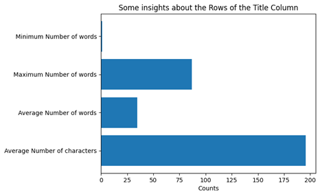
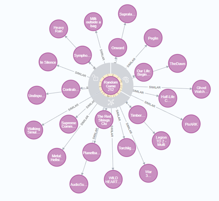
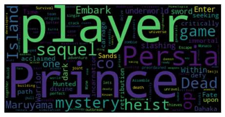

# Game Recommendation System

## Introduction
Welcome to the Game Recommendation System project. Our system leverages advanced data analysis and machine learning techniques to recommend games to users based on their preferences and gaming history.

## Features

- **New Game Recommendation**: Generate and evaluate potential new games based on user ratings predictions.
- **Game Clustering**: Utilize PCA to cluster games, aiding in recommendations and market understanding.
- **Topic Modeling**: Employ LDA for extracting prevalent themes from game descriptions to enhance content-based recommendations.

## Data Sources
Our system uses the kaggle open-source [dataset](https://www.kaggle.com/datasets/antonkozyriev/game-recommendations-on-steam), including game details (`games.csv`), user profiles (`users.csv`), recommendations (`recommendations.csv`), and extensive game descriptions (`games_metadata.json`).

## Technologies
We use **MongoDB** and **PostgreSQL** for data management and **Neo4j** for visualizing game relationships through graph databases.

## Modular Design
The project is structured into modules for **data import, clustering, topic modeling, and recommendation generation**, ensuring flexibility and maintainability.

## Results
### Text Analysis of Game Titles


*Figure 1: Text Analysis of Game Titles* - This bar chart provides insights into the complexity of game titles within our database. It reveals the minimum, maximum, and average number of words and characters, offering a glimpse into current naming trends in the gaming industry.

### Game Clustering Graph


*Figure 2: Game Clustering Graph* - Our game clustering feature is visualized in this graph, which groups games based on similarities in their features. The graph illustrates the connections between various titles, enabling users to discover new games within their areas of interest.

### Topic Modeling Word Cloud


*Figure 3: Topic Modeling Word Cloud* - The word cloud represents the most prominent themes derived from game descriptions using LDA topic modeling. This visualization aids in identifying the most frequent and significant themes that resonate with our user base.  

## Installation and Usage
#### Step 1: Install Docker
1. Download and install Docker Desktop from the [official Docker website](https://www.docker.com/products/docker-desktop). Follow the provided installation guide.
2. You may be required to create a Docker account if you don't already have one.

#### Step 2: Start Docker Containers
1. Navigate to the directory containing your `docker-compose-sihan.yml` file.
2. Run the following command to start the containers in detached mode:
   ```shell
   docker-compose -f docker-compose-sihan.yml up -d

## Contributing
Contributions are welcome!

## License
This project is licensed under the MIT License.

## Acknowledgments
Special thanks to the HDSI program instructors and our peers for their support and guidance.

